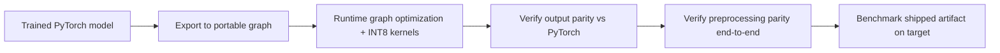

# Lecture 3 — Export, runtimes & statistically honest benchmarking

A model trapped in a Python notebook is not deployed. To run on the edge it must be **exported** to a
portable representation, executed by an efficient **runtime** on the target, and **benchmarked honestly** so
your deployment claim is real, not aspirational. Each of those three verbs hides subtleties that sink real
projects.

## Export: leaving PyTorch behind

Edge devices rarely run full PyTorch. You export the trained model to a portable graph:

- **ONNX** (Open Neural Network Exchange) — a framework-neutral graph IR: a list of typed tensors and
  operators drawn from a versioned **opset**. Export from PyTorch via `torch.onnx.export`, run almost anywhere
  via **ONNX Runtime**. The common interchange hub.
- **TorchScript** — PyTorch's own serialized, Python-free format (`torch.jit.trace` records the ops a sample
  input triggers; `torch.jit.script` compiles control flow), runnable from C++.
- **TensorFlow Lite (TFLite)** — the standard for Android and microcontrollers; supports INT8 and a
  micro-runtime.
- **Core ML** — Apple's on-device format for iOS/Neural Engine. **TensorRT** — NVIDIA's optimizing runtime
  for Jetson-class edge GPUs.

```python
torch.onnx.export(model, example_input, "model.onnx",
                  input_names=["image"], output_names=["logits"], opset_version=17)
```

The runtime then applies **graph optimizations**: **operator fusion** (fold conv + batchnorm + ReLU into one
kernel to cut memory round-trips — a memory-bound win, per Lecture 1's roofline), constant folding, and
mapping ops onto the target's INT8 kernels. Two failure modes appear here. First, an **unsupported operator**:
`trace` captures only the path the sample input took, so data-dependent control flow or an exotic op may
export wrong or not at all — `script` or a custom op is the fix. Second, and worse:

## Preprocessing parity — the #1 silent deployment bug

The most common deployment failure is not the model — it is a **preprocessing mismatch**. If training resized,
cropped, and normalized images one way and the deployed pipeline does it even slightly differently — a
different resize interpolation, center-crop vs. squash, **BGR vs. RGB** channel order (Week 1), the wrong
per-channel mean/std, uint8 [0,255] vs. float [0,1] scaling — accuracy silently collapses in production while
*every offline test on your correctly-preprocessed data still passes*. There is no exception, no crash: just
quietly worse predictions. **Pin and verify the entire preprocessing pipeline end-to-end on the target**,
byte-for-byte, and make a deliberate-mismatch test part of your suite so the failure is unforgettable.

## Verify output parity before you trust the export

Before benchmarking, confirm the exported model reproduces the PyTorch original: run both on the same fixed
inputs and assert the outputs match to a small tolerance (e.g. `np.allclose(a, b, atol=1e-4)`). A mismatch
signals an unsupported op, a shape/layout bug (NCHW vs. NHWC), or a fusion that changed numerics. Parity first,
then speed.


*From a trained model to a verified, benchmarked artifact on the actual target before it counts as deployed.*

## Benchmarking like a scientist

Amateur benchmarking reports "it runs in 20 ms" from one timed call on a dev laptop. That number is almost
always wrong. Do it right, **on the target hardware**:

- **Warm up.** The first inferences pay one-time costs — lazy allocation, JIT/kernel compilation, cold caches,
  and on mobile, DVFS clock ramp-up. Discard warmup runs; measure steady state.
- **Report a distribution, not a point.** Give the **median** and the **tail (p95/p99)** over many runs.
  Real-time systems live or die on the tail: a 30 fps stream needs the p99 under 33 ms, not just the average.
  Report min as a hardware ceiling and note variance.
- **Measure the shipped artifact.** Latency, memory, size, and above all **accuracy** must be measured on the
  *exported, quantized* model — the thing you will actually ship — on held-out data. The FP32 pre-export
  accuracy is not your production accuracy.
- **Control the environment.** Fix batch size (usually 1 for latency-bound edge), pin threads, disable
  turbo/DVFS if you want reproducibility, and state device, clock, and thermal state. Report **peak RAM**
  (weights + activations) and **on-disk size** too.

Then plot the **accuracy-latency (or accuracy-size) frontier** across your optimization steps — FP32 →
pruned → INT8 — and pick the Pareto-optimal point *for the stated constraint*. The honest deliverable is that
curve plus a justified choice, never "the biggest model."

## The engineering mindset

Edge deployment is constrained optimization: maximize accuracy subject to hard latency/memory/power limits.
There is no single best model, only the best model *for these constraints*, measured on *this* target as the
*shipped* artifact. Honesty here is the difference between a system that works in the field and one that only
worked in the notebook.

**Takeaway:** deploy by exporting to a portable graph (ONNX/TorchScript/TFLite/Core ML) whose runtime fuses ops
and uses INT8 kernels; verify output parity and — the classic silent killer — end-to-end preprocessing parity
(resize, channel order, normalization). Benchmark the *shipped* artifact on the *target* with warmup, median
*and* tail (p95/p99) latency, peak memory, size, and held-out accuracy, then pick the Pareto-optimal point on
the accuracy-latency frontier for the stated constraint. The pre-export FP32 number is never your production
number.
