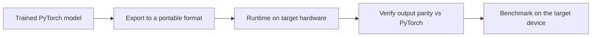

# Lecture 3 — Export, runtimes & honest benchmarking

A model trapped in a Python notebook isn't deployed. To run on the edge it must be **exported** to a portable format and executed by an efficient **runtime** on the target — and then **benchmarked honestly** so your deployment claim is real, not aspirational.

## Export: leaving PyTorch behind

Edge devices rarely run full PyTorch. You export the trained model to a portable representation:
- **ONNX** (Open Neural Network Exchange) — a framework-neutral format; export from PyTorch, run almost anywhere via **ONNX Runtime**. The common interchange hub.
- **TorchScript** — PyTorch's own serialized, Python-free format (`torch.jit.trace`/`script`), runnable in C++.
- **TensorFlow Lite (TFLite)** — the standard for Android and microcontrollers.
- **Core ML** — Apple's on-device format for iOS.
- **TensorRT** — NVIDIA's optimizing runtime for their edge GPUs (Jetson).

```python
torch.onnx.export(model, example_input, "model.onnx",
                  input_names=["image"], output_names=["logits"])
```

The runtime then applies hardware-specific optimizations (operator fusion, the target's INT8 kernels). Export is also where subtle bugs appear — an unsupported operator, or preprocessing that doesn't match training. **Verify parity:** the exported model must produce the *same* outputs as the PyTorch original on test inputs before you trust it.


*From a trained model to a portable export, run and verified on the actual target before it counts as deployed.*

## Preprocessing parity — the classic deployment bug

The #1 deployment failure isn't the model — it's **preprocessing mismatch**. If training resized/normalized images one way and the deployed pipeline does it differently (a different resize, BGR vs. RGB from Week 1, wrong normalization), accuracy silently collapses in production while every offline test passes. Pin and verify the *entire* preprocessing pipeline end to end on the target.

## Benchmarking honestly

Report the full trade-off, measured **on the target hardware** (not your dev GPU):
- **Latency** — median *and* tail (p95/p99) ms per image; real-time needs the tail under budget, not just the average. Measure after warmup.
- **Throughput** — images/second, if batching.
- **Memory** — peak RAM (weights + activations).
- **Model size** — on-disk bytes.
- **Accuracy** — on held-out data, for the *exported, quantized* model — the version you'll actually ship, not the float original.

Plot accuracy vs. latency (or size) across your optimization steps: float → quantized → pruned. The honest deliverable is this curve plus a *justified pick* for the stated constraints, not just 'the biggest model.'

## The engineering mindset

Edge deployment is a *constrained optimization*: maximize accuracy subject to hard latency/memory/power limits. There is no single best model — only the best model *for these constraints*. And measure the shipped artifact: an accuracy number from the pre-quantization, pre-export model is not your production accuracy. Honesty here is the difference between a system that works in the field and one that only worked in the notebook.

**Takeaway:** deploy by exporting to a portable format (ONNX/TorchScript/TFLite/Core ML) run by an efficient on-target runtime — and verify output parity and, above all, preprocessing parity (the classic silent-failure bug). Benchmark the *shipped* (exported, quantized) model on the *target* hardware: latency (median and tail), memory, size, and held-out accuracy. Pick the best model for the constraints, and report the real numbers.
