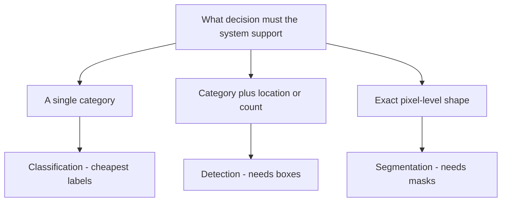
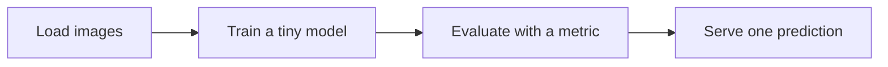

# Lecture 1 — Scoping a vision project that finishes

The most common capstone failure isn't a weak model — it's a project scoped so big it never
finishes, or so vague it can't be evaluated. Scope is not a nicety; at the graduate level it is a
resource-allocation problem governed by the **economics of annotation** and the **statistics of
evaluation**, and both push you toward the smallest task that still supports the decision you care about.

## Frame the decision first, then the task

A vision project exists to support a *decision or action* — flag a defect, count cells, blur a face, route
a document. Write that decision down before choosing a task, because the decision fixes the metric, and the
metric fixes what "good" means. Only then map to a task:

- **Classification** (Weeks 3–5) — "what is this image / region?" One label per image (or per crop). The
  most tractable; ideal when the decision is a category and transfer learning gives you a strong model from
  modest data.
- **Detection** (Week 6) — "what objects, and where?" Needs boxed annotations; use when location or count
  drives the decision. Report mAP at a *stated* IoU threshold — mAP@0.5 and mAP@[.5:.95] are different
  claims.
- **Segmentation** (Week 7) — "which pixels?" Needs masks (the most expensive label); use only when exact
  shape drives the decision (medical margins, precise editing). Report mIoU or Dice, and say which.

*Match the task to the decision; annotation cost rises steeply down this chain.*

## The annotation-economics argument

Down that chain, labeling cost per image explodes: an image-level label is seconds of work; a set of tight
boxes is minutes; a pixel-perfect mask can be tens of minutes and is itself noisy at object boundaries.
Northcutt et al. (2021, "Pervasive Label Errors in Test Sets", NeurIPS Datasets & Benchmarks) found
label-error rates of several percent even in *canonical* benchmarks like ImageNet — your hand-labeled set
will be worse. The implication is sharp: **prefer the simplest task that solves your problem** not out of
laziness but because every dollar spent on unnecessary mask annotation is a dollar not spent on more images,
harder negatives, or a cleaner test set — the things that actually move a metric. Transfer learning
(Week 5) is your default starting point regardless of task, because it converts your scarce labels into a
head on top of features someone else paid millions of GPU-hours to learn.

## Baseline first — and make it strong

Before any custom training, establish a **baseline** with a documented, reproducible number on held-out
images. Three tiers, from cheap to strong:
1. **Trivial** — majority class, a color/size heuristic, a classical-vision detector (Week 2). Establishes
   the floor and the metric plumbing.
2. **Fine-tuned small model** — a pretrained backbone with a linear head. The honest workhorse baseline.
3. **Zero-shot foundation model** — CLIP for classification (Radford et al., 2021, ICML) or SAM for
   promptable segmentation (Kirillov et al., 2023, ICCV) with *no* training. In 2020s vision this is often a
   startlingly strong baseline, and if your fine-tuned model cannot beat a zero-shot foundation model, that
   is a finding you want on day 2, not day 6.

If your model cannot beat the baseline, that is the result — and you want to know early. The baseline also
*defines success*: "we improved defect recall from 0.71 to 0.88 at fixed precision" is a claim; "our model
is good" is not.

## Scope to a working end-to-end slice

Get the *whole pipeline* working small first — load images → train a tiny model → evaluate → serve one
prediction — end to end, badly, in a day. Vision has extra failure surfaces (data loading, annotation
format, preprocessing parity between train and serve) that a working skeleton de-risks before they can
eat your final week.

*Get this whole slice working end to end and badly before improving any single part.*

## Plan the week, and reserve time for the writing

Roughly: days 1–2 framing + data + annotation + baseline (all three tiers) + end-to-end skeleton; days 3–5
model building and training (transfer learning, the Week-4 toolbox); day 6 evaluation — *with statistics*,
calibration, error gallery, and fairness audit; day 7 deployment, drift plan, README, model card, and the
written defense. The communication and the statistics are graded, not just the accuracy. A finished B+
project with an honest interval beats an unfinished A+ one with a cherry-picked number.

**Takeaway:** frame the *decision* first, then pick the *simplest task that supports it* — annotation
economics and label noise both reward restraint. Establish a strong baseline (up to a zero-shot foundation
model) with a stated metric and threshold before you train anything, get the whole pipeline working small,
and reserve real time for statistics, fairness, and writing. Scope for *finished and defensible*, not
*maximal*.
