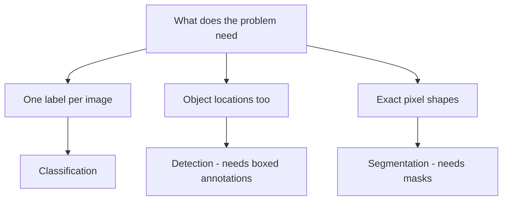
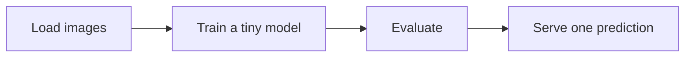

# Lecture 1 — Scoping a vision project that finishes

The most common capstone failure isn't a weak model — it's a project scoped so big it never finishes, or so vague it can't be evaluated. Scope deliberately, and the rest follows.

## Pick a task and a dataset you can actually use

Choose a problem with (1) images you can obtain and are *allowed* to use (mind licenses, privacy, and consent — the course's ethics rules are binding here), (2) a clear **metric** matched to the task, and (3) a **baseline** to beat. A project without a metric and a baseline can't be judged, including by you.

Match the *task* to your goal and data:
- **Classification** (Weeks 3–5) — "what is this image?" The most tractable; ideal if your problem is one-label-per-image and you have modest data (transfer learning shines).
- **Detection** (Week 6) — "what objects, and where?" Needs boxed annotations; use when location/counting matters.
- **Segmentation** (Week 7) — "which pixels?" Needs masks (expensive); use when exact shape matters (medical, precise editing).

*Match the task to what the problem actually needs — annotation cost rises fast down this chain.*

When unsure, prefer the *simplest task that solves your problem* — classification over detection over segmentation — because annotation cost and difficulty rise sharply. Transfer learning (Week 5) is almost always your starting point regardless of task.

## Baseline first

Before any deep model, establish a **baseline**: a trivial predictor (majority class, a color/size heuristic), a classical-vision approach (Week 2 features), or a simple fine-tuned small model. If your fancy model can't beat the baseline, that's the finding — and you want to know early. The baseline also defines "success."

## Scope to a working end-to-end slice

Get the *whole pipeline* working small first — load images → train a tiny model → evaluate → serve one prediction — end to end, badly, in a day. Then improve each part. A finished B+ project beats an unfinished A+ one, and vision has extra failure surfaces (data loading, annotation, preprocessing parity) that a working skeleton de-risks early.

*Get this whole slice working end to end and badly before improving any single part.*

## Plan the week

Roughly: days 1–2 framing + data + annotation + baseline + end-to-end skeleton; days 3–5 model building and training (transfer learning, the Week-4 toolbox); day 6 evaluation + error analysis + bias check; day 7 deployment, serving, README, model card. Reserve real time for evaluation and writing — the communication is graded, not just the accuracy.

**Takeaway:** pick a vision task you can finish — the *simplest task that solves your problem*, with images you're allowed to use, a clear metric, and a baseline to beat. Start from transfer learning, get the whole pipeline working small before improving parts, and reserve real time for honest evaluation and writing. Scope for *finished*, not *maximal*.
