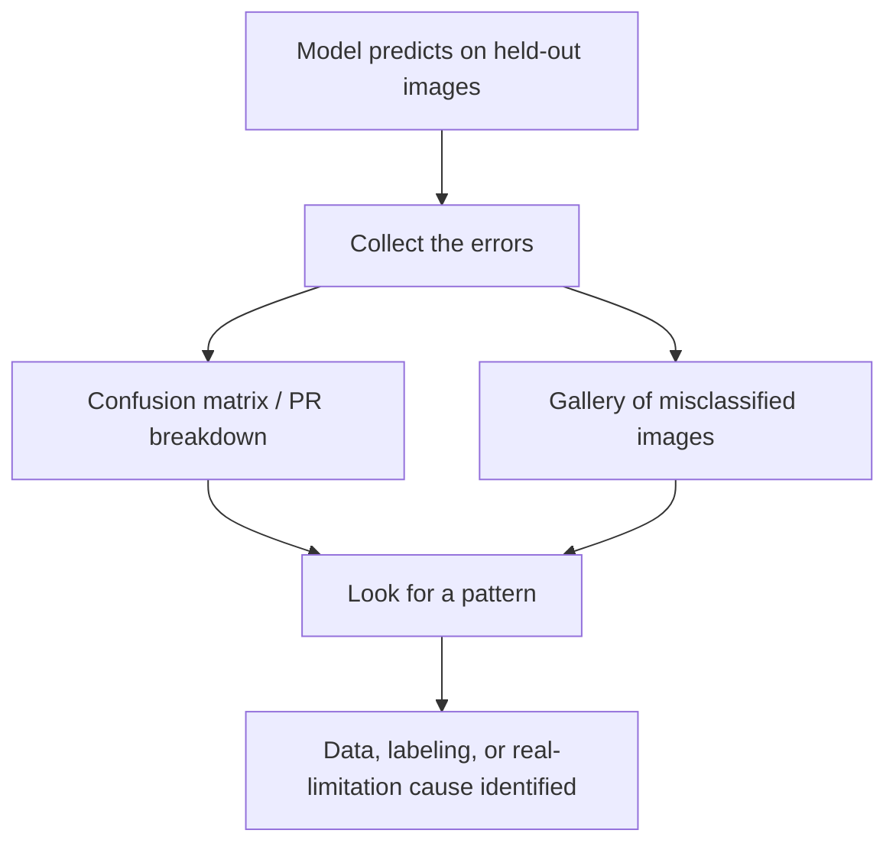

# Lecture 2 — Honest evaluation & error analysis for vision

A single accuracy (or mAP, or mIoU) number is the *beginning* of evaluation, not the end. The
capstone is graded heavily on evaluating like a professional — because a vision model you cannot trust is
worthless no matter its headline metric, and vision carries specific traps that quietly manufacture fake
results.

## The rules you already know, enforced

- **Held-out images only.** Report the headline metric on a test set the model never saw and you never
  tuned against. A peeked-at test set is a training set; hyperparameter search on the test set is the most
  common way strong-looking capstones are secretly overfit.
- **The right metric, stated exactly.** Accuracy for balanced classification; per-class precision/recall,
  F1, and a confusion matrix under imbalance (Week 4); mAP at a *named* IoU for detection (Week 6);
  mIoU/Dice for segmentation (Week 7). Also state the operating point — a detector's mAP hides the fact
  that in production you must pick one confidence threshold, so report precision/recall *at that threshold*
  too.
- **No leakage.** Split by *group* — near-duplicate images, multiple photos of the same subject, or frames
  from one video (Week 9) must all land in one split. Fit every preprocessing statistic (normalization
  means, PCA, class weights) on train only. Correlated images across the split boundary produce beautiful,
  fake numbers.

## Error analysis: vision lets you *see* the mistakes

Vision has a superpower for error analysis: you can look at what the model gets wrong. Pull the errors and
*study* them. A confusion matrix plus a **gallery of misclassified images** (or bad boxes/masks overlaid)
tells you more than any scalar — and typically reveals one of three root causes: a data problem, a labeling
problem, or a genuine limitation. Are errors concentrated in one class, one lighting condition, one
viewpoint, one object scale, one background? This visual error analysis is the single habit that most
separates professionals from amateurs in vision.

*Visual error analysis turns a pile of mistakes into a diagnosis.*

## Calibration: your probabilities are probably lying

Modern deep classifiers are systematically **overconfident** — a softmax output of 0.99 does not mean the
model is right 99% of the time (Guo et al., 2017, "On Calibration of Modern Neural Networks", ICML). If any
downstream decision uses the *confidence* (a "flag for human review below 0.8" rule, a risk threshold, a
cost-sensitive action), an uncalibrated model is dangerous even at high accuracy. Measure it. Bin
predictions by confidence, plot a **reliability diagram** (mean confidence vs. empirical accuracy per bin),
and report the **Expected Calibration Error**,

    ECE = Σ_b (n_b / n) · | acc(b) − conf(b) |,

the accuracy-weighted average gap between confidence and accuracy across bins. If ECE is large, apply
**temperature scaling** — divide the logits by a single scalar T fit on validation data to minimize NLL —
which is a cheap, monotonic post-hoc fix that leaves the argmax (and thus accuracy) unchanged while
correcting the probabilities. A capstone whose confidences are used but never calibrated is incomplete.

## Dataset bias & subgroup performance — an obligation, not an extra

Vision datasets are notoriously skewed — by geography, skin tone, lighting, camera quality, and object
context. Report performance *per meaningful subgroup*, not just overall, and lead with the **worst-group
metric and the disparity**, not the average. Buolamwini & Gebru (2018, "Gender Shades", FAccT) showed
commercial gender-classification systems with sub-1% error on lighter-skinned men and error rates over 30%
on darker-skinned women — a system "97% accurate overall" that was, for a whole population, broken. A model
that is 95% accurate overall but far worse on an underrepresented group is not a 95% model for those people,
and shipping it as if it were is an ethical failure the course explicitly forbids. Surface it.

## Robustness and the real distribution

Probe beyond your clean test set. How does the model behave under corruption (blur, noise, JPEG artifacts,
weather, brightness) and under shift (a different camera, backgrounds, or population than training)?
Hendrycks & Dietterich (2019, ImageNet-C, ICLR) formalized this with a corruption benchmark; you can build a
small version by applying a fixed corruption suite to your own test set and reporting the metric drop. Pay
special attention to where the model is **confidently wrong** — high-confidence errors are the dangerous
ones, and they are exactly what an uncalibrated model over-produces. Document the edges; vision models are
brittle to distribution shift and an honest capstone says where.

**Takeaway:** evaluate on untouched, group-split held-out images with the task's exact metric *and* its
operating point; do a *visual* error analysis to diagnose root causes; measure calibration with a
reliability diagram and ECE (and fix it with temperature scaling) whenever confidence is used; audit
per-subgroup performance and lead with the worst group; and probe robustness under corruption and shift.
Naming where, for whom, and how confidently the model fails is the professional core of the capstone.
