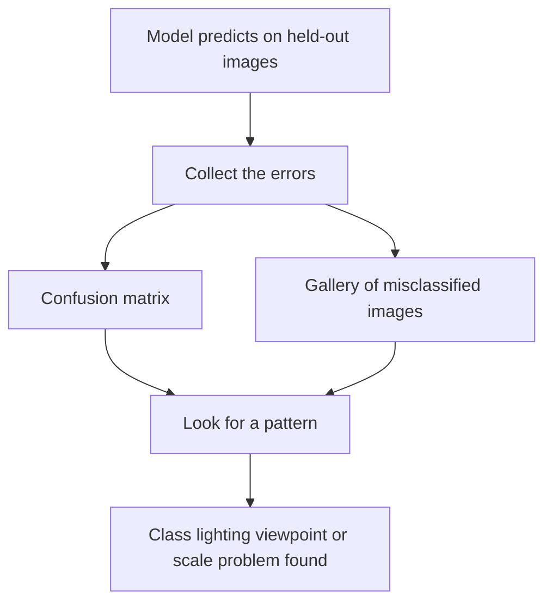

# Lecture 2 — Honest evaluation & error analysis for vision

A single accuracy (or mAP, or mIoU) number is the *beginning* of evaluation, not the end. The capstone is graded heavily on evaluating like a professional — because a vision model you can't trust is worthless no matter its headline metric, and vision carries specific evaluation traps.

## The rules you already know, enforced

- **Held-out images only.** Report metrics on a test set the model never saw and you never tuned against. A peeked-at test set is a training set.
- **The right metric.** Accuracy for balanced classification; per-class precision/recall and a confusion matrix otherwise (Week 4); mAP at a stated IoU for detection (Week 6); mIoU/Dice for segmentation (Week 7). State exactly which metric and threshold.
- **No leakage.** Split by *group* — near-duplicate images, multiple photos of the same subject, or frames from one video (Week 9) must all land in one split. Fit preprocessing stats on train only. Leakage produces beautiful, fake results.

## Error analysis: look at what it gets wrong

Vision has a superpower for error analysis: you can *see* the mistakes. Pull the model's errors and *study* them. A confusion matrix plus a **gallery of misclassified images** (or bad boxes/masks overlaid) tells you more than any single number — and often reveals a data problem, a labeling problem, or a real limitation. Are errors concentrated in one class, one lighting condition, one viewpoint, one object scale? This visual error analysis is the single most valuable habit separating amateurs from professionals in vision.

*Visual error analysis turns a pile of mistakes into a diagnosis.*

## Dataset bias & subgroup performance

Vision datasets are notoriously skewed — by geography, skin tone, lighting, camera quality, and object context. Report performance *per meaningful subgroup*, not just overall. A face or person model that's 95% accurate overall but far worse on darker skin tones or underrepresented groups is not a 95% model for those people — and shipping it as if it were is an ethical failure the course explicitly forbids. Surface this; it's an obligation, not an optional extra.

## Robustness and the real distribution

Probe beyond your clean test set: how does the model behave on shifted, noisy, compressed, or out-of-distribution images — different cameras, lighting, backgrounds than training? Where does it break *confidently* (high-confidence wrong predictions are the dangerous ones)? Vision models are especially brittle to distribution shift; document the edges.

**Takeaway:** evaluate on untouched held-out images with the task's right metric (accuracy/mAP/mIoU, stated precisely), split by group to prevent leakage, and do a *visual* error analysis on the mistakes — vision lets you see failure. Report per-subgroup performance to surface dataset bias (an ethical must), and probe robustness to real-world distribution shift. Naming where and for whom the model fails is the professional core of the capstone.
