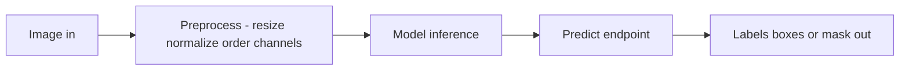

# Lecture 3 — Deploying & communicating a vision system

A brilliant model no one can run, trust, or understand doesn't count. The capstone deliverable is a *deployed system and a story*, not a notebook. This is where Weeks 11 and the whole course's honesty ethos land.

## Deploy it — with preprocessing parity

Serve the model behind a simple **inference API** (a `/predict` endpoint that takes an image and returns predictions — labels, boxes, or a mask). If it targets the edge, apply Week 11: an efficient architecture, quantization, export to a portable format, and honest on-target benchmarks. The non-negotiable: **verify preprocessing parity** — the deployed pipeline must resize, normalize, and order channels *exactly* as training did (Week 11's #1 bug). Show that a real input sent to your API returns the right answer.

*Preprocessing must match training exactly or predictions silently break.*

## Reproducibility

Someone else — a reviewer, an employer, future-you — must be able to clone and run it:
- **Pinned dependencies** and a Python version.
- **Clear entry points** to train (`train.py`) and to run inference / serve.
- **Fixed seeds** where it matters, and instructions to obtain the data.
- **Saved artifacts:** the trained weights (or a script to reproduce them) and the exported model.

If it only runs on your laptop with undocumented steps, it isn't finished.

## The README is the front door

A strong README states: the problem and why it matters, the data (and its provenance/licenses), the task and model, the results **vs. the baseline** (a table), how to reproduce, a demo (an image in → prediction out), and — prominently — the limitations. Lead with what the system *does* and *proves*; show a result early (a metric table, an annotated example image).

## The model card

Ship a **model card** (the course's recurring requirement, now formalized): intended use, training data and its provenance/licenses, evaluation metrics *including per-subgroup*, known failure modes, robustness notes, and ethical considerations — for vision, explicitly addressing privacy, consent, and bias. This is how responsible ML is documented industry-wide, and vision's privacy weight makes it essential.

## Tell the honest story

The best capstones don't hide the warts — they *explain* them. "Here's what worked, here's where it fails, here's who it could harm, here's what I'd do with more data/compute" reads as competence, not weakness. Overclaiming reads as the opposite. Your evaluation already found the failure modes and biases; put them in the story.

## What you've built

Twelve weeks ago an image was a mystery grid of numbers. Now you've filtered pixels by hand, engineered classical features, built and trained CNNs, stood on pretrained giants, detected and segmented objects, tracked motion, understood video, built Vision Transformers, and deployed to the edge. The capstone is proof — to an employer and to yourself — that you can take a computer-vision problem from nothing to a trustworthy, deployed system, and defend every choice in it.

**Takeaway:** package for reproducibility (pinned deps, clear entry points, saved artifacts), deploy behind an inference API with *verified preprocessing parity*, make the README a front door that leads with results-vs-baseline and limitations, ship a model card that names failure modes and addresses privacy/consent/bias, and tell the honest story including the failures. The deliverable is a computer-vision system you'd show an employer — and you're ready to build it.
