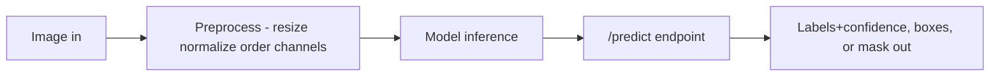

# Lecture 3 — Deploying & communicating a vision system

A brilliant model no one can run, trust, or understand doesn't count. The capstone deliverable is
a *deployed system and a story*, not a notebook. This is where Week 11 and the whole course's honesty ethos
land — and where a graduate project adds the two things a portfolio project usually lacks: a **drift plan**
and a **datasheet**.

## Deploy it — with preprocessing parity

Serve the model behind a simple **inference API** (a `/predict` endpoint that takes an image and returns
predictions — labels with confidences, boxes, or a mask). If it targets the edge, apply Week 11: an
efficient architecture, quantization, export to a portable format (ONNX/TFLite/Core ML), and honest
on-target latency and memory benchmarks. The non-negotiable: **verify preprocessing parity** — the deployed
pipeline must resize (same interpolation and aspect handling), normalize (same mean/std), and order channels
(RGB vs. BGR) *exactly* as training did. This is Week 11's #1 bug and it fails silently: no exception, just
quietly wrong predictions. Prove parity with a golden test — a fixed input whose training-time and
served-time model output must match to within numerical tolerance.

*Preprocessing must match training exactly, or predictions silently break.*

## Reproducibility

Someone else — a reviewer, an employer, future-you — must be able to clone and run it:
- **Pinned dependencies** (a lockfile) and a pinned Python/CUDA version.
- **Clear entry points**: `train.py` to reproduce the model, an inference/serve script, and an `eval.py`
  that regenerates every number and figure in your README.
- **Fixed seeds** where it matters, and documented, licensed instructions to obtain the data.
- **Saved artifacts**: the trained weights (or a script to reproduce them), the exported model, and the
  exact preprocessing config the server loads.

If it only runs on your laptop with undocumented steps, it isn't finished.

## Monitor for drift — the model decays after you ship

A vision model is trained on a snapshot of the world and deployed into a moving one: new cameras, seasons,
lighting, product SKUs, or demographics arrive that the training set never saw. This is **data drift**
(the input distribution moves) and **concept drift** (the input→label relationship moves), and it silently
degrades a model that scored 95% on launch day. You cannot compute accuracy in production without labels,
so monitor *proxies*: the distribution of predicted classes, the mean confidence, an embedding-distribution
distance (e.g., a two-sample test on backbone features), and a small stream of human-reviewed spot checks.
Your capstone must include a **drift-monitoring plan** — what you would log, what would trip an alert, and
what the retraining trigger is. Naming this is the difference between a demo and a system.

## The README is the front door

A strong README states: the problem and why it matters, the data (and its provenance and licenses), the
task and model, the results **vs. the baseline with a confidence interval** (a table), how to reproduce, a
demo (an image in → prediction out), and — prominently — the limitations. Lead with what the system *does*
and *proves*; show a result early (a metric table, an annotated example image).

## The model card and the datasheet

Ship a **model card** (Mitchell et al., 2019, "Model Cards for Model Reporting", FAccT): intended use and
out-of-scope uses, training data and its provenance/licenses, evaluation metrics *including per-subgroup*,
known failure modes, robustness and calibration notes, and ethical considerations — for vision, explicitly
addressing privacy, consent, and bias. Pair it with a **datasheet** for your dataset (Gebru et al., 2021,
"Datasheets for Datasets", CACM): how the data was collected, who is in it, what consent covers, and what
it must not be used for. Together they are how responsible ML is documented industry-wide, and vision's
privacy weight makes them essential rather than optional.

## Tell the honest story

The best capstones don't hide the warts — they *explain* them. "Here's what worked, here's where it fails,
here's who it could harm, here's the confidence interval, here's the drift risk, here's what I'd do with
more data" reads as competence. Overclaiming reads as the opposite. Your evaluation already found the
failure modes, the miscalibration, and the biases; put them in the story.

## What you've built

Twelve weeks ago an image was a mystery grid of numbers. Now you have filtered pixels by hand, engineered
classical features, built and trained CNNs, stood on pretrained giants, detected and segmented objects,
tracked motion, understood video, built Vision Transformers, and deployed to the edge. The capstone is
proof — to an employer and to yourself — that you can take a computer-vision problem from nothing to a
trustworthy, deployed, documented system, and defend every choice in it.

**Takeaway:** package for reproducibility (pinned deps, `eval.py` that regenerates every figure, saved
artifacts); deploy behind a `/predict` API with a *golden-test-verified* preprocessing parity; ship a
concrete drift-monitoring plan because models decay after launch; make the README a front door that leads
with results-vs-baseline-with-interval and limitations; and document the system in a model card + datasheet
that name failure modes and address privacy/consent/bias. The deliverable is a computer-vision system you
would show an employer — and you're ready to build it.
