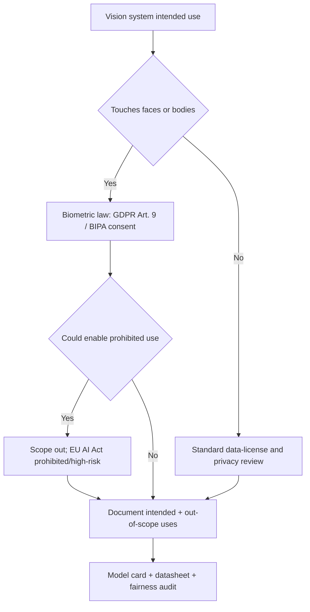

# Lecture 5 — State of the art & responsible deployment: foundation models, shift, and the law

Your capstone ships into 2020s computer vision, where three forces reshape what a "good" system
looks like: **foundation models** have raised the baseline you must beat, **distribution shift and
adversarial robustness** determine whether a lab number survives contact with reality, and a fast-hardening
body of **law and auditing practice** governs where a vision model may be deployed at all. A graduate
capstone situates itself against all three.

## Foundation models: the baseline moved

The last five years turned large pretrained vision (and vision-language) models into off-the-shelf,
zero-shot baselines that are often embarrassingly strong.

- **CLIP** (Radford et al., 2021, "Learning Transferable Visual Models From Natural Language Supervision",
  ICML) trains an image encoder and a text encoder to align via a contrastive InfoNCE loss over 400M
  image-text pairs. The payoff: **zero-shot classification** by comparing an image embedding to the
  embeddings of text prompts like "a photo of a {class}" — no training on your labels at all. This is a
  legitimate, often formidable baseline for any classification capstone.
- **SAM** (Kirillov et al., 2023, "Segment Anything", ICCV) is a promptable segmentation model trained on
  1.1B masks; it produces high-quality masks from a point or box prompt with no fine-tuning, a strong
  zero-shot floor for segmentation.
- **DINOv2** (Oquab et al., 2023) provides self-supervised features that transfer to detection,
  segmentation, and retrieval with only a linear head — the modern "frozen backbone + small head" recipe.

The practical consequence for your capstone: **your fine-tuned model must beat a zero-shot foundation-model
baseline**, or the honest conclusion is "for this problem, a frozen foundation model is enough." Either
outcome is a strong result — but you must run the comparison, because a reviewer will ask.

## Distribution shift and adversarial robustness

A model is trained on a snapshot and deployed into a moving, sometimes adversarial world.

- **Natural shift.** Recht et al. (2019, "Do ImageNet Classifiers Generalize to ImageNet?", ICML) built a
  *new* ImageNet test set by the original protocol and found accuracy dropped 11–14 points across models —
  from overfitting to the specific benchmark, not the task. Your clean test accuracy is an *upper bound* on
  field performance. Probe with a corruption suite (Hendrycks & Dietterich, 2019, ImageNet-C) and, if you
  can, a genuinely different data source.
- **Adversarial shift.** Szegedy et al. (2014, "Intriguing properties of neural networks", ICLR) and
  Goodfellow et al. (2015, "Explaining and Harnessing Adversarial Examples", ICLR) showed imperceptible,
  crafted perturbations flip predictions with high confidence. Whether this matters is a *threat-model*
  question: a security-camera classifier faces adversaries; a microscopy classifier largely does not.
  State your threat model explicitly; do not hand-wave "it's robust."

## Auditing, documentation, and the law

Vision is the most privacy-laden modality in ML, and the regulatory floor is rising fast. Your model card
must name where the system may and may not be used.

- **Biometrics and consent.** Faces, gait, and iris are biometric identifiers. The **EU GDPR** treats
  biometric data used for identification as a special category (Art. 9) requiring an explicit lawful basis;
  **Illinois' BIPA** requires informed written consent before capturing face geometry and has produced
  nine-figure settlements. If your capstone touches faces, consent and provenance are not optional
  paperwork — they are the difference between a usable and an unlawful system.
- **Prohibited and high-risk uses.** The **EU AI Act** (2024) bans certain uses outright (untargeted
  scraping of facial images to build recognition databases; most real-time remote biometric identification
  in public spaces) and classes others as "high-risk" (Annex III), demanding risk management, data
  governance, logging, and human oversight. US municipalities (San Francisco, Boston, and others) have
  restricted government face recognition. A capstone whose model *could* be used for a prohibited purpose
  must say so and scope its intended use to exclude it.
- **Fairness auditing as standard practice.** Raji & Buolamwini (2019, "Actionable Auditing", AAAI/ACM
  AIES) showed public bias audits measurably changed commercial systems. The Gender Shades methodology —
  disaggregated evaluation across intersectional subgroups — is now the expected standard, not a bonus. Your
  per-subgroup audit from Lecture 2 *is* a mini-audit; frame it as one.

*Route your system through the legal and ethical checks before you call it done.*

## Putting it together in the defense

A graduate defense answers, without flinching: Why this task and architecture? How do you know the win is
not sampling noise (interval + paired test)? Are the probabilities calibrated? Where and for whom does it
fail (subgroup audit, worst-group metric)? How brittle is it to shift, and what is the threat model? Where
may it *not* be deployed, legally and ethically? What would you monitor after launch, and what triggers a
retrain? Answering these is what turns a project into a system — and a candidate into a hire.

**Takeaway:** benchmark against a zero-shot foundation-model baseline (CLIP/SAM/DINOv2) — beating it, or
honestly conceding it suffices, is a real result; treat your clean test number as an upper bound and probe
natural and, where the threat model warrants, adversarial shift; and route your system through the
biometric-law and EU-AI-Act checks, documenting intended and out-of-scope uses in a model card + datasheet
backed by a disaggregated fairness audit. State of the art is not just a better metric — it is a system that
survives reality and the law.
